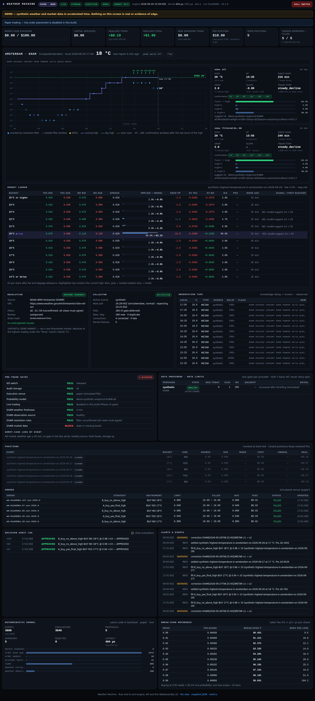

# Weather Machine

Automated research and **paper** trading of Polymarket *daily highest
temperature* markets, in Rust end to end: collectors, rate limiting,
deterministic trading kernel, risk engine, execution simulator, backtester,
storage, API and a WebAssembly dashboard. Location #1 is Amsterdam /
Schiphol (EHAM); nothing in the strategy code is Amsterdam-specific.



> **Status.** Research platform and paper trading. Live order placement
> does not exist in this build (Phase 14 gate). Nothing here is financial
> advice, and synthetic/demo results are not evidence of edge.

## What it does

* **Collects EHAM METARs respectfully.** One collector per station (with a
  PostgreSQL lease across processes), official NOAA sources (AWC Data API,
  NWS TGFTP), and one rate-limit gate per provider: ≥ 30 s spacing,
  `Retry-After`, backoff with jitter, circuit breaker, daily budget, and
  politeness after throttling. Polling is scheduled around the expected
  HH:25/HH:55 reports and never speeds up to chase limits.
* **Keeps everything.** Raw payloads, every request, observation versions
  and corrections, verbatim market rules (SHA-256), every decision with its
  inputs, orders and fills, and a replayable journal of every engine input.
* **Decides deterministically.** The same kernel runs in backtest, demo and
  paper. The chain is: temperature state → peak detection per resolution view
  → probability model trained on real EHAM history (downloaded from IEM and
  trained automatically on first start, retrained every 30 days in the
  background and swapped in without a restart) → strategies (A: buy YES of
  the final-high bucket, B: buy NO above it, C: split/unwind research, D:
  outcomes the observations have already decided, bought on the report
  itself) → risk engine → simulated venue. A and B pool the model with the
  market's price: the book can veto a trade, never create one.
* **Uses forecasts only when they are proven.** A day-1 forecast (Open-Meteo
  Previous Runs: every hourly value forecast 24 h ahead, the same product in
  training and live, so no look-ahead) can refine the model with one feature:
  does the forecast expect the rest of the day to get warmer? Training runs a
  walk-forward test with a placebo control, and the forecast changes trading
  probabilities only if it clearly improves them. The verdict is in the
  training report and on the dashboard.
* **Fails closed.** A throttled or unhealthy provider, stale data, gaps in the
  day's series, recent corrections, stale books, unverified resolution rules,
  no model, storage down, or the kill switch each block new weather-dependent
  positions.
* **Shows it all.** A dashboard with live SSE updates shows the intraday
  chart, peak state and model distribution, market ladder (implied vs model,
  edge, EV, break-even), gates, provider rate limits, blotter, decision audit
  log and kernel latency. A zero-JS `/lite` view, JSON API and Prometheus
  metrics are also served.

## Quick start

```sh
# Demo: real engine on synthetic data in accelerated time — no network, no database.
cargo run -p wm-app -- demo            # open http://localhost:8080/lite
./ui/build.sh                          # optional: build the WASM dashboard (needs wasm-bindgen-cli 0.2.129)
WM_UI_DIR=ui/dist cargo run -p wm-app -- demo   # full dashboard at http://localhost:8080/
```

Docker / Portainer:

```sh
docker run --rm -p 8080:8080 ghcr.io/spongi07/weathermachine:latest demo
cp stack.env.example .env   # set WM_DB_PASSWORD, WM_CONTACT, WM_ADMIN_TOKEN
docker compose up -d        # PostgreSQL 18 + paper-trading service + nightly backups
```

For Portainer (Git stack, demo stack, variables, backups, upgrades), see
**[docs/deployment/portainer.md](docs/deployment/portainer.md)**.

## CLI

| Command | Purpose |
|---|---|
| `weather-machine run` | Paper-trading service (default) |
| `weather-machine demo [--speed 60]` | Synthetic accelerated demo |
| `weather-machine collect [--once] [--no-db]` | Phase-0 data experiment: collectors only, zero trades |
| `weather-machine model train` | Download METAR history from IEM and day-1 forecast history from Open-Meteo (rate-limited, cached), train the model and evaluate the forecast; `run` does this automatically |
| `weather-machine research peak-survival --csv … --model-out …` | P(high is final \| N min) with Wilson CIs from a CSV; trains the model |
| `weather-machine research market [--from --to --delay-secs --print]` | Model versus market on settled markets (Polymarket Data API trades, cached): who predicts better, the best `market_weight`, who is sure first, how fast dead buckets reprice, resolution check |
| `weather-machine backtest --synthetic-days N` / `--journal <run-id>` | Backtests with fidelity labels |
| `weather-machine markets discover [--date]` | Fetch and parse today's markets and rules (read-only) |
| `weather-machine rules approve --sha256 … --reviewer …` | Human approval of a rules text |
| `weather-machine ev-table` | Break-even probabilities (fees included) |
| `weather-machine migrate` · `check-config` · `healthcheck` | Operations |

## Configuration

`configs/weather-machine.toml` (engine, providers and their rate-limit
policies, polling, risk, strategies) and `configs/locations/*.toml` (one
file per city). Deployment-specific values come only from the environment:

| Variable | Meaning |
|---|---|
| `WM_DATABASE_URL` or `WM_DB_PASSWORD` (+ `WM_DB_HOST/PORT/USER/NAME`) | PostgreSQL (audit storage; required to trade) |
| `WM_CONTACT` / `WM_USER_AGENT` | Contact for the NOAA User-Agent (required) |
| `WM_ADMIN_TOKEN` | Operator token (kill switch) |
| `WM_DASHBOARD_USER` / `WM_DASHBOARD_PASSWORD` | Optional Basic auth |
| `WM_MODEL_PATH` | Model file (default `/data/models/<station>.json`); without a model, no weather trades |
| `WM_MODEL_AUTO_TRAIN` | `false` stops automatic training from IEM history (default `true`) |
| `WM_FORECAST` | `false` never fetches or evaluates the day-1 forecast (default `true`) |
| `WM_FORECAST_MODEL` | Open-Meteo model id for the day-1 forecast (default `gfs_global`) |
| `WM_OPEN_METEO_API_KEY` | Open-Meteo subscription key; the free tier is for non-commercial use |
| `WM_DATA_DIR` | Writable data directory for the model and history cache (default `/data`) |
| `WM_JOURNAL_RETENTION_DAYS` | Days of order-book updates kept in the replay journal (default 7; 0 = keep) |
| `WM_BACKUP_JOURNAL` | Stack only: include the replay journal in nightly backups (default `false`) |
| `WM_MODE`, `WM_HTTP_BIND`, `WM_UI_DIR`, `WM_LOG_FORMAT`, `WM_CONFIG` | Overrides |

## Development

```sh
cargo fmt --all && cargo clippy --workspace --all-targets -- -D warnings
cargo test --workspace                                   # PostgreSQL tests need:
WM_TEST_DATABASE_URL=postgres://wm:wm@localhost:5432/wm_test cargo test --workspace
(cd ui && cargo clippy --target wasm32-unknown-unknown -- -D warnings && ./build.sh)
```

Toolchain: Rust 1.94.1 (`rust-toolchain.toml`, includes the wasm32 target).
CI (`.github/workflows/ci.yml`) runs fmt, clippy, all tests against
PostgreSQL 18, the WASM build and a dependency audit. It then builds the
container, smoke-tests it (hardened runtime, health, API, assets) and pushes
to GHCR.

## Documentation

* **[Technical blueprint](docs/blueprint/README.md)**: all 43 components
  (purpose, inputs, outputs, Rust interface, failure modes, testing) with
  KNOWN FACT / ASSUMPTION / HYPOTHESIS TO BACKTEST labels, the dependency
  rationale, the historical-data audit and the Phase 0–14 roadmap.
* [Deployment with Portainer](docs/deployment/portainer.md).
* [Forecast layer and its evaluation](docs/blueprint/05-markets.md#19-forecastprovider-and-the-day-1-forecast-feature).
* [Review of the "weatherforecaster" bot](docs/research/weatherforecaster-review.md):
  why its backtest edge came from look-ahead, and what was (not) ported.
* [Where the edge is — and where it is not](docs/research/edge-research.md):
  the market versus models, decided outcomes (strategy D), pooling with the
  book, and how to measure it on EHAM's settled markets.
